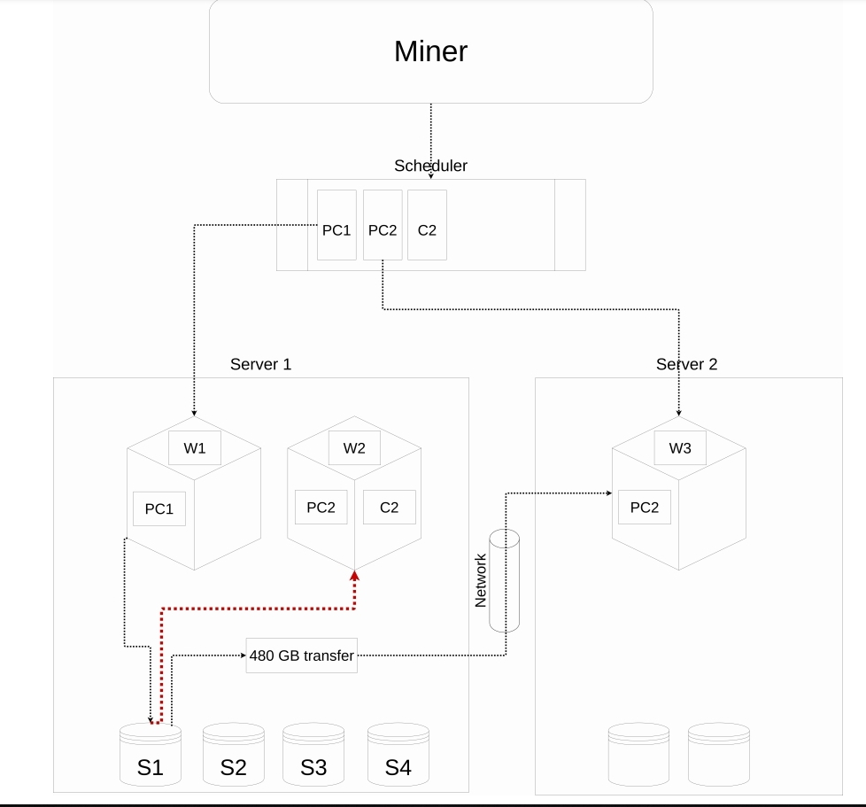

# Lotus Manual Scheduler
### Adding more options to lotus scheduler
<br />

# How come we added manual layout configuration?
Currently, task assignment is automated by the miner scheduler. The scheduler schedules tasks based on the available resources. Once it finds an open window with the required resources, the miner assigns it, and it is not aware of server layouts.

<br /><br />

# When is manual layout configuration necessary?
Consider that we have multiple servers that they do PC1 and PC2 on separate machines. Suppose there are two servers that can both do PC1 or PC2. The data can be transferred between them over the network, while it can also choose a local worker to avoid using the network. This problem only occurs when PC1 + PC2 on more than one machine.




The PC1 worker will finish its work, report that it finished to the lotus-miner and the
miners' scheduler then looks for a PC2 worker to schedule the next step. The miner is unaware of server layouts. The scheduler looks for workers that support PC2 task type.
Afterwards, the data is transferred between PC1 and PC2.

With the ability to control the flow of a sector, we can select which tasks are carried to which servers. For instance, if we are doing the PC2 job in the same place, no transfer of data is required to server 2.

<br /><br />

# Configuring your layout manually: Getting started
You should set the configuration json file after starting the Lotus project. Set the file in the `$LOTUS_MINER_LAYOUT` directory. 
```sh
export LOTUS_MINER_LAYOUT=/home/user/layout.json
```
The configuration file is in JSON format. If the configuration file is not created or the property `checkLayout` is set to **false**, the scheduler will ignore the layout configuration logic.

The `loadConfigFilePerMinute` option takes a number, and determines how often a config file is updated. For example, if you update a config, it keeps it for this duration

```json
{
  "checkLayout": true,
  "loadConfigFilePerMinute": 1,
  "groups": []
}
```
### This is all you need to set for setting the config file

<br />

| Parameter | Default Value |Description|
| -------------          | ------------- |------------- |
| checkLayout | true  | When set to false, the scheduler ignores the layout configuration logic  |
| loadConfigFilePerMinute           | 1  | Determines how often a config file should be updated  |
| groups           | empty  | It includes a list of groups, The group is a list of workers and sectors in one layout  |

<br />

You can set your custom logic  in groups 

will be updated soon...